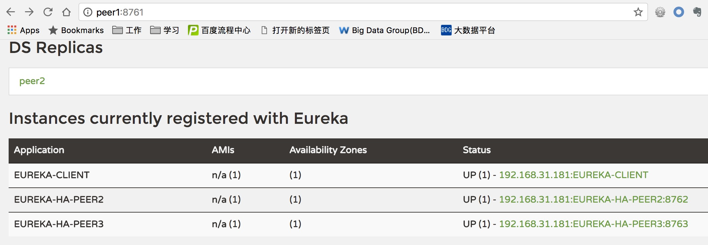
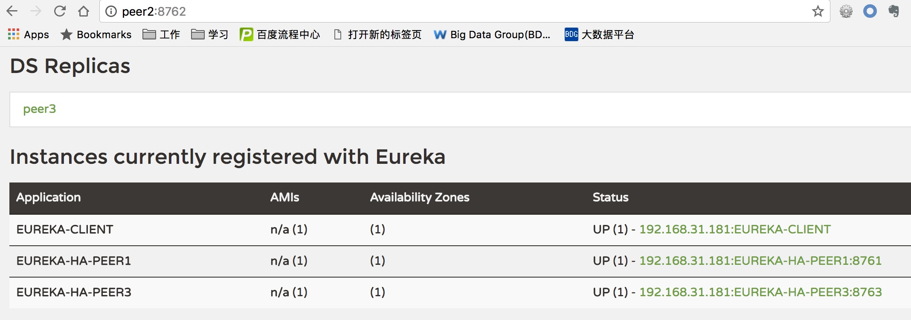
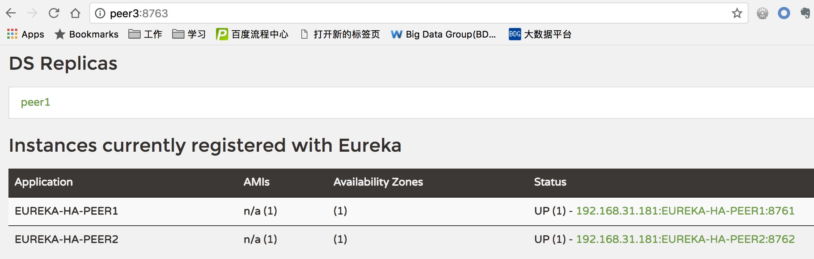

# spring-cloud-eureka-poc

主要是为了测试一下Eureka的HA机制。

针对这个帖子反映的问题：[Eureka doesn't replicate its registry info to all servers](https://stackoverflow.com/questions/39118722/eureka-doesnt-replicate-its-registry-info-to-all-servers)，做了一个实际测试。

三个Eureka Server: peer1 -> peer2, peer2 -> peer3, peer3 -> peer1
一个Eureka Client: client -> peer1

测试结果：

client 在 peer1 和 peer2上有注册信息，但是在peer3上没有。如下图所示：

**结论**

Eureka并不是一个一致性的注册中心，只是一个简单的数据同步来保证高可用，但是并没有集群的概念。

